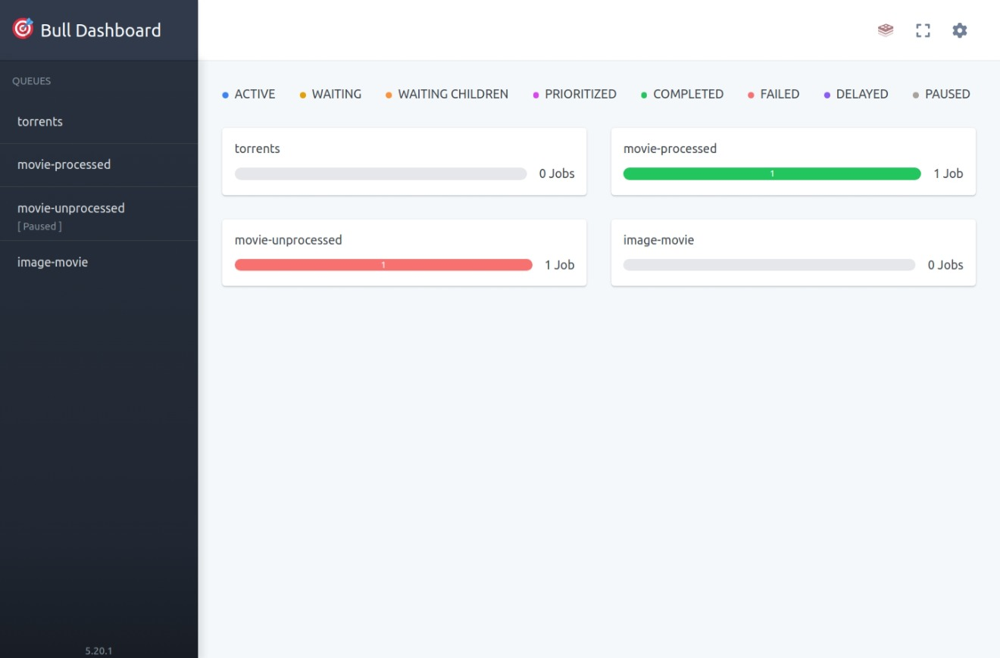

# Bull Board Fast GUI

**A Lightning-Fast Dashboard for Bull Queue Management**

## About

Bull Board Fast GUI provides a quick and efficient way to visualize and manage your Bull queues through a user-friendly dashboard. 
It's designed for developers who need to set up and monitor their queues rapidly without the need for installation or configuration in their own projects.



## Features

- Super fast setup and configuration
- Supports multiple queues
- Customizable UI base path
- Detailed job management

## Quick Start

You can run Bull Board Fast GUI directly using `npx` without needing to install it in your project.

### Example

To visualize and manage multiple queues (`torrents`, `movie-processed`, `movie-unprocessed`, `image-movie`) with a Redis server running locally:

```bash
BULL_CONNECTION=redis://localhost:6379 \
BULL_QUEUES=torrents,movie-processed,movie-unprocessed,image-movie \
BULL_PORT=3000 \
npx bull-board-fast-gui
```

### Environment Variables

Before running Bull Board Fast GUI, you need to set the following environment variables:

- `BULL_CONNECTION`: The Redis connection string (default: `redis://127.0.0.1:6379`)
- `BULL_QUEUES`: A comma-separated list of queue names (default: `messages`)
- `BULL_UI_BASE_PATH`: The base path for the UI (default: `/admin/queues`)
- `BULL_PORT`: The port on which the dashboard will run (default: `3000`)

### Running the Dashboard

To run the dashboard, simply use the following command:

```bash
BULL_CONNECTION=redis://localhost:6379 \
BULL_QUEUES=torrents,movie-processed,movie-unprocessed,image-movie \
BULL_PORT=3000 \
npx bull-board-fast-gui
```

Then visit the dashboard in your browser:

```bash
http://localhost:3000/admin/queues
```

## Configuration Options

### `BULL_CONNECTION`

The connection string for your Redis instance. This is where your Bull queues are stored.

Example:
```bash
BULL_CONNECTION=redis://localhost:6379
```

### `BULL_QUEUES`

A comma-separated list of Bull queue names that you want to monitor.

Example:
```bash
BULL_QUEUES=torrents,movie-processed,movie-unprocessed,image-movie
```

### `BULL_UI_BASE_PATH`

The base path where the dashboard will be accessible.

Example:
```bash
BULL_UI_BASE_PATH=/admin/queues
```

### `BULL_PORT`

The port on which the dashboard will be served.

Example:
```bash
BULL_PORT=3000
```

## Contributing

We welcome contributions! Please see the [CONTRIBUTING.md](CONTRIBUTING.md) for details on how to get started.

## License

This project is licensed under the MIT License - see the [LICENSE](LICENSE) file for details.

## Contact

For any issues or suggestions, please open an issue on the [GitHub repository](https://github.com/jorcelinojunior/bull-board-fast-gui/issues).

---

Happy queue managing! 🚀